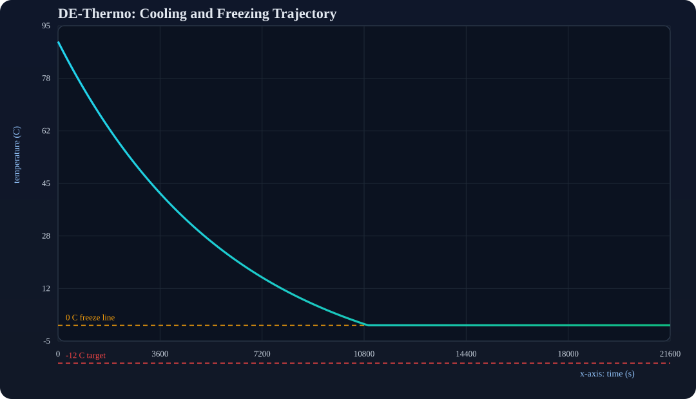
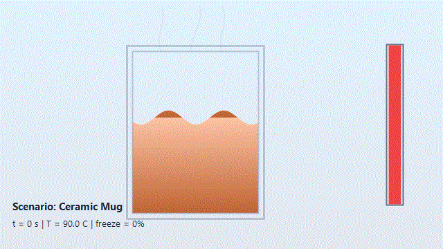
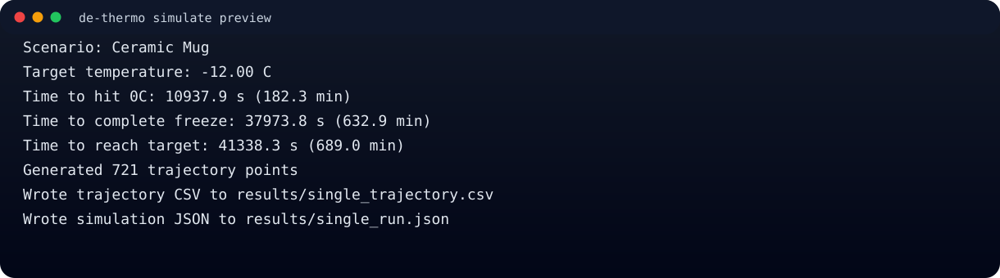

# DE-Thermo (C# Upgrade)

DE-Thermo was upgraded from a Python prototype into a practical C# CLI for thermal planning and reliability analysis.

## What is better now

- No GUI lock-in: full terminal workflow.
- Better physics model:
  - liquid cooling (Newton law)
  - latent heat plateau during freezing
  - post-freeze ice cooling
- Useful engineering commands:
  - `simulate`: full trajectory + milestone timings
  - `batch`: run many scenarios from JSON
  - `optimize`: find minimum HTC for a freeze deadline
  - `monte-carlo`: uncertainty and probability of meeting deadlines
- Includes a desktop GUI (`DEThermo.Gui`) for interactive simulation and visualization.
- Outputs for decision workflows: CSV, JSON, and Markdown report.

## Stack

- Language: C# (.NET 9)
- Parallel execution: `Parallel.For`
- Serialization: `System.Text.Json`

## Quick start

```bash
dotnet build DEThermo.Cli/DEThermo.Cli.csproj -c Release
dotnet build DEThermo.Gui/DEThermo.Gui.csproj -c Release
```

## GUI app

Launch the desktop simulator:

```bash
dotnet run --project DEThermo.Gui --configuration Release
```

GUI features:

- Parameter input form (mass, temperatures, area, HTC, target, duration, step)
- One-click simulation run
- Real water animation panel (wavy liquid, freezing ice growth, steam/frost transitions)
- Animation behavior changes with scenario values (mass, area, HTC, temperatures)
- Live trajectory chart with `0 C` and target reference lines
- Milestone summary (`t(0C)`, freeze completion, target reachability)
- Export last run as CSV

## Usage

Run one simulation:

```bash
dotnet run --project DEThermo.Cli --configuration Release -- simulate \
  --name "Ceramic Mug" \
  --mass-kg 0.35 \
  --initial-temp-c 90 \
  --ambient-temp-c -18 \
  --area-m2 0.03 \
  --htc-w-m2k 8 \
  --target-temp-c -12 \
  --duration-s 21600 \
  --step-s 30 \
  --csv-output results/single_trajectory.csv \
  --json-output results/single_run.json
```

Run a batch:

```bash
dotnet run --project DEThermo.Cli --configuration Release -- batch \
  --input scenarios/sample_scenarios.json \
  --csv-output results/batch_summary.csv \
  --json-output results/batch_summary.json \
  --report-output results/batch_report.md
```

Optimize HTC for a freeze deadline:

```bash
dotnet run --project DEThermo.Cli --configuration Release -- optimize \
  --mass-kg 0.35 \
  --initial-temp-c 90 \
  --ambient-temp-c -18 \
  --area-m2 0.03 \
  --freeze-deadline-s 21600 \
  --htc-min 1 \
  --htc-max 120 \
  --json-output results/optimize.json
```

Monte Carlo:

```bash
dotnet run --project DEThermo.Cli --configuration Release -- monte-carlo \
  --name "Ceramic Mug Uncertainty" \
  --mass-kg 0.35 \
  --initial-temp-c 90 \
  --ambient-temp-c -18 \
  --area-m2 0.03 \
  --htc-w-m2k 8 \
  --target-temp-c -12 \
  --deadline-s 43200 \
  --samples 5000 \
  --json-output results/monte_carlo_12h.json
```

## Sample input format

See `scenarios/sample_scenarios.json`.

```json
{
  "target_temp_c": -12.0,
  "duration_s": 21600.0,
  "step_s": 60.0,
  "scenarios": [
    {
      "name": "Ceramic Mug",
      "mass_kg": 0.35,
      "initial_temp_c": 90.0,
      "ambient_temp_c": -18.0,
      "area_m2": 0.03,
      "htc_w_m2k": 8.0
    }
  ]
}
```

## Generated results

This repo now includes executed outputs in `results/`:

- `results/cli_preview.svg`
- `results/cli_preview.txt`
- `results/single_trajectory.svg`
- `results/water_animation.gif`
- `results/batch_report.md`
- `results/batch_summary.csv`
- `results/batch_summary.json`
- `results/optimize.json`
- `results/monte_carlo_12h.json`
- `results/single_run.json`
- `results/single_trajectory.csv`

### Result preview



### Water and Freezing Animation Preview



Regenerate this GIF from real simulation output:

```bash
./scripts/render-water-animation-gif.ps1 -InputJson results/single_run.json -OutputGif results/water_animation.gif
```

### CLI usage preview

Command used:

```bash
dotnet run --project DEThermo.Cli --configuration Release -- simulate --name "Ceramic Mug" --mass-kg 0.35 --initial-temp-c 90 --ambient-temp-c -18 --area-m2 0.03 --htc-w-m2k 8 --target-temp-c -12 --duration-s 21600 --step-s 30 --csv-output results/single_trajectory.csv --json-output results/single_run.json
```

Actual output:



## Publish workflow

```bash
git add .
git commit -m "Upgrade DE-Thermo to C# CLI with simulation, optimization, and Monte Carlo analysis"
git push origin main
```
